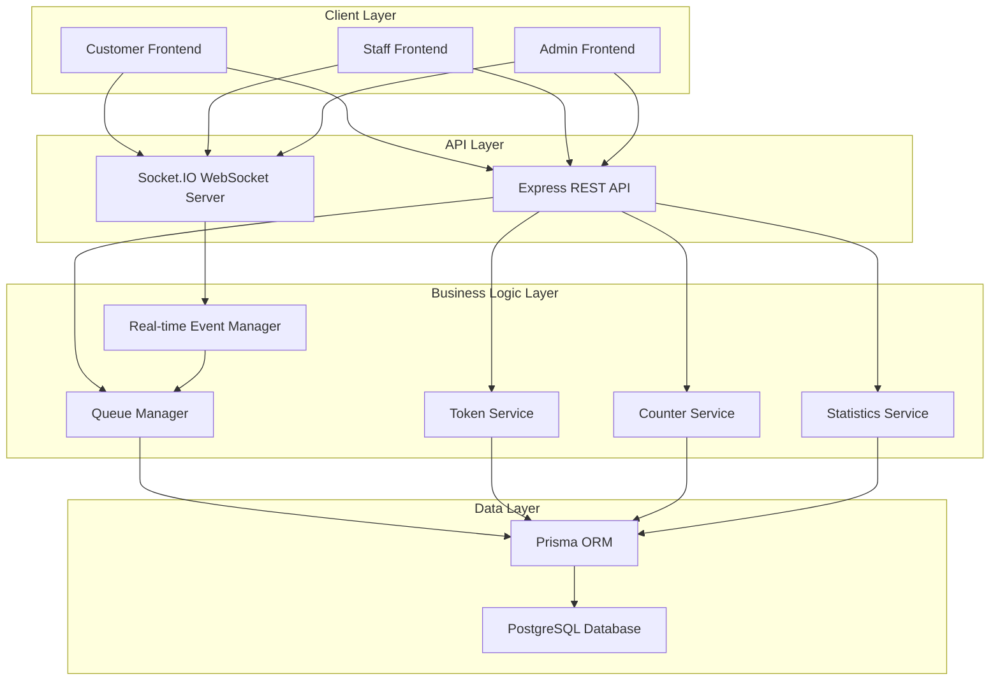

# Design Document: SwiftPost Backend

## Overview

The SwiftPost Backend is a Node.js-based queue management system that serves as the intelligent core for managing service tokens, queue operations, and real-time updates. The system follows a layered architecture with clear separation between API endpoints, business logic, data persistence, and real-time communication.

The backend implements a producer-consumer pattern where customers generate tokens (producers) and staff serve them (consumers), with intelligent queue management ensuring optimal service flow and real-time updates keeping all stakeholders informed.

## Architecture

The system follows a modular, event-driven architecture built on Node.js with the following key components:



## Components and Interfaces

### 1. Express REST API Server
**Responsibility**: Handle HTTP requests and provide RESTful endpoints for frontend communication.

**Key Endpoints**:
- `POST /api/tokens` - Generate new token
- `GET /api/tokens/:tokenNumber` - Get token status
- `PUT /api/tokens/next` - Assign next token to counter
- `PUT /api/tokens/:tokenNumber/complete` - Mark token as completed
- `GET /api/counters` - Get counter status
- `POST /api/counters` - Add new counter
- `GET /api/statistics` - Get queue statistics

**Interface**:
```typescript
interface APIResponse<T> {
  success: boolean;
  data?: T;
  error?: string;
  timestamp: Date;
}

interface TokenRequest {
  serviceType: 'Parcel Drop-off' | 'Banking Services' | 'General Inquiry' | 'Document Verification';
}

interface TokenResponse {
  tokenNumber: string;
  queuePosition: number;
  estimatedWaitTime: number;
  serviceType: string;
}
```

### 2. Socket.IO Real-time Server
**Responsibility**: Manage WebSocket connections and broadcast real-time updates to connected clients.

**Event Types**:
- `token-called` - Notify specific customer their token is ready
- `queue-updated` - Broadcast queue position changes
- `counter-status-changed` - Notify counter availability changes
- `statistics-updated` - Push live statistics to admin dashboard

**Interface**:
```typescript
interface SocketEvents {
  'token-called': (data: { tokenNumber: string, counterNumber: number }) => void;
  'queue-updated': (data: { tokenNumber: string, newPosition: number, estimatedWait: number }) => void;
  'counter-status-changed': (data: { counterId: number, status: 'active' | 'inactive' }) => void;
  'statistics-updated': (data: StatisticsData) => void;
}
```

### 3. Queue Manager Service
**Responsibility**: Core business logic for managing token queue, assignments, and ordering.

**Key Methods**:
- `generateToken(serviceType)` - Create new token with unique number
- `getNextToken()` - Retrieve earliest waiting token
- `assignTokenToCounter(tokenNumber, counterId)` - Assign token to specific counter
- `completeToken(tokenNumber)` - Mark token as completed and free counter
- `calculateQueuePosition(tokenNumber)` - Determine current position in queue
- `estimateWaitTime(queuePosition)` - Calculate estimated waiting time

**Interface**:
```typescript
class QueueManager {
  async generateToken(serviceType: ServiceType): Promise<Token>;
  async getNextToken(): Promise<Token | null>;
  async assignTokenToCounter(tokenNumber: string, counterId: number): Promise<void>;
  async completeToken(tokenNumber: string): Promise<void>;
  async calculateQueuePosition(tokenNumber: string): Promise<number>;
  async estimateWaitTime(queuePosition: number): Promise<number>;
}
```

### 4. Counter Service
**Responsibility**: Manage service counter states and availability.

**Key Methods**:
- `addCounter()` - Register new service counter
- `activateCounter(counterId)` - Mark counter as available
- `deactivateCounter(counterId)` - Mark counter as unavailable
- `getAvailableCounters()` - List all active counters
- `assignCounter(counterId, tokenNumber)` - Assign token to counter

### 5. Real-time Event Manager
**Responsibility**: Coordinate between business logic and WebSocket communications.

**Key Methods**:
- `broadcastQueueUpdate(tokenNumber, newPosition)` - Send queue updates
- `notifyTokenCalled(tokenNumber, counterNumber)` - Alert specific customer
- `broadcastStatistics(stats)` - Push live statistics
- `notifyCounterStatusChange(counterId, status)` - Update counter status

## Data Models

### Database Schema (Prisma)

```prisma
model Token {
  id            Int       @id @default(autoincrement())
  tokenNumber   String    @unique
  serviceType   String
  status        TokenStatus @default(WAITING)
  queuePosition Int?
  counterId     Int?
  createdAt     DateTime  @default(now())
  calledAt      DateTime?
  completedAt   DateTime?
  
  counter       Counter?  @relation(fields: [counterId], references: [id])
  
  @@map("tokens")
}

model Counter {
  id        Int           @id @default(autoincrement())
  number    Int           @unique
  status    CounterStatus @default(ACTIVE)
  createdAt DateTime      @default(now())
  
  tokens    Token[]
  
  @@map("counters")
}

enum TokenStatus {
  WAITING
  SERVING
  COMPLETED
}

enum CounterStatus {
  ACTIVE
  INACTIVE
}
```

### Core Data Types

```typescript
interface Token {
  id: number;
  tokenNumber: string;
  serviceType: ServiceType;
  status: TokenStatus;
  queuePosition?: number;
  counterId?: number;
  createdAt: Date;
  calledAt?: Date;
  completedAt?: Date;
}

interface Counter {
  id: number;
  number: number;
  status: CounterStatus;
  createdAt: Date;
  currentToken?: Token;
}

interface QueueStatistics {
  totalTokensToday: number;
  tokensInQueue: number;
  averageWaitTime: number;
  activeCounters: number;
  inactiveCounters: number;
}
```

## Correctness Properties

*A property is a characteristic or behavior that should hold true across all valid executions of a system-essentially, a formal statement about what the system should do. Properties serve as the bridge between human-readable specifications and machine-verifiable correctness guarantees.*

After analyzing the acceptance criteria, I've identified several key properties that can be consolidated to avoid redundancy:

**Property Reflection**: Several properties can be combined for more comprehensive testing:
- Token format and uniqueness can be tested together
- Token state transitions can be combined into comprehensive lifecycle properties  
- Queue ordering and position calculations are related and can be tested together
- API response consistency can be tested across all endpoints

### Core Properties

**Property 1: Token Generation Consistency**
*For any* service type and concurrent token requests, all generated tokens should follow the format [Service_Letter]-[Sequential_Number], be unique, start with "Waiting" status, and be sequential within each service type
**Validates: Requirements 1.1, 1.2, 1.4, 1.5**

**Property 2: Queue Ordering Invariant**
*For any* set of tokens in the queue, the next token returned should always be the earliest waiting token based on creation timestamp, and queue positions should be calculated correctly based on waiting tokens created before the queried token
**Validates: Requirements 2.1, 2.4, 6.3**

**Property 3: Token State Transition Correctness**
*For any* token assignment and completion, the token status should transition correctly (Waiting → Serving → Completed), counter assignments should be tracked properly, and counters should be freed upon completion
**Validates: Requirements 2.2, 2.3, 4.4, 4.5**

**Property 4: Real-time Notification Consistency**
*For any* token status change or queue position update, the real-time service should broadcast appropriate updates to all connected clients and send targeted notifications to specific customers when their tokens are called
**Validates: Requirements 3.1, 3.2, 3.3**

**Property 5: Counter Management Correctness**
*For any* counter addition, deactivation, or availability change, the system should register counters correctly, prevent assignments to inactive counters, and automatically assign waiting tokens to available counters
**Validates: Requirements 4.1, 4.2, 4.3**

**Property 6: Statistics Calculation Accuracy**
*For any* set of token and counter data, statistics calculations should accurately reflect total tokens, queue length, average waiting times, and counter utilization based on the underlying data
**Validates: Requirements 5.1, 5.2, 5.3, 5.4, 5.5**

**Property 7: API Response Consistency**
*For any* API request, responses should follow consistent JSON format with appropriate HTTP status codes, provide descriptive error messages for failures, and validate input formats before processing
**Validates: Requirements 6.1, 6.5, 8.1, 8.2, 8.3, 8.4, 8.5**

**Property 8: Data Persistence Round-trip**
*For any* token creation or status change, the data should be immediately persisted to the database and retrievable with all relevant information intact, including timestamps and counter assignments
**Validates: Requirements 7.1, 7.2, 7.4**

**Property 9: Wait Time Estimation Consistency**
*For any* queue position and average service time, the estimated waiting time calculation should be consistent and based on the current queue position multiplied by average service time
**Validates: Requirements 1.3, 6.4**

## Error Handling

The system implements comprehensive error handling across all layers:

### API Layer Error Handling
- **Input Validation**: All API endpoints validate request parameters and return 400 Bad Request for invalid inputs
- **Authentication Errors**: Return 401 Unauthorized for missing or invalid authentication
- **Resource Not Found**: Return 404 Not Found for non-existent tokens or counters
- **Server Errors**: Return 500 Internal Server Error with sanitized error messages
- **Rate Limiting**: Implement rate limiting to prevent abuse and return 429 Too Many Requests

### Business Logic Error Handling
- **Concurrent Token Generation**: Use database transactions to prevent duplicate token numbers
- **Invalid State Transitions**: Prevent invalid token status changes (e.g., Completed → Waiting)
- **Counter Assignment Conflicts**: Handle cases where multiple tokens are assigned to the same counter
- **Queue Consistency**: Maintain queue integrity even during system failures

### Database Layer Error Handling
- **Connection Failures**: Implement connection pooling and retry logic for database connections
- **Transaction Rollbacks**: Use database transactions for multi-step operations
- **Data Integrity**: Enforce foreign key constraints and data validation at the database level
- **Backup and Recovery**: Regular database backups and point-in-time recovery capabilities

### Real-time Communication Error Handling
- **Connection Drops**: Handle WebSocket disconnections gracefully with automatic reconnection
- **Message Delivery**: Implement message queuing for offline clients
- **Broadcasting Failures**: Retry failed broadcasts and log errors for monitoring

## Testing Strategy

The SwiftPost Backend employs a comprehensive dual testing approach combining unit tests and property-based tests to ensure correctness and reliability.

### Property-Based Testing
Property-based testing will be implemented using **fast-check** for JavaScript/TypeScript, which provides excellent support for generating random test data and shrinking failing examples.

**Configuration Requirements**:
- Minimum 100 iterations per property test
- Each property test must reference its design document property
- Tag format: **Feature: swiftpost-backend, Property {number}: {property_text}**

**Key Property Tests**:
1. **Token Generation Properties**: Test token format, uniqueness, and sequencing across all service types
2. **Queue Management Properties**: Verify queue ordering, position calculations, and state transitions
3. **Real-time Communication Properties**: Validate broadcasting and notification consistency
4. **API Response Properties**: Ensure consistent response formats and error handling
5. **Data Persistence Properties**: Verify round-trip data integrity and timestamp accuracy

### Unit Testing
Unit tests complement property tests by focusing on specific examples, edge cases, and integration points:

**Unit Test Focus Areas**:
- **Specific Examples**: Test known scenarios with predictable outcomes
- **Edge Cases**: Empty queues, invalid token formats, concurrent operations
- **Error Conditions**: Database failures, invalid inputs, network errors
- **Integration Points**: API endpoint responses, database queries, WebSocket events

**Testing Framework**: Jest with TypeScript support for comprehensive unit testing

### Test Organization
```
tests/
├── unit/
│   ├── services/
│   │   ├── queueManager.test.ts
│   │   ├── counterService.test.ts
│   │   └── statisticsService.test.ts
│   ├── api/
│   │   ├── tokens.test.ts
│   │   ├── counters.test.ts
│   │   └── statistics.test.ts
│   └── database/
│       └── models.test.ts
├── properties/
│   ├── tokenGeneration.property.test.ts
│   ├── queueManagement.property.test.ts
│   ├── realTimeUpdates.property.test.ts
│   └── dataConsistency.property.test.ts
└── integration/
    ├── api.integration.test.ts
    └── websocket.integration.test.ts
```

### Testing Balance
- **Property tests**: Handle comprehensive input coverage through randomization
- **Unit tests**: Focus on specific examples, edge cases, and error conditions
- **Integration tests**: Verify component interactions and end-to-end flows
- Both property and unit tests are essential for comprehensive coverage

<function_calls>
<invoke name="prework">
<parameter name="featureName">swiftpost-backend